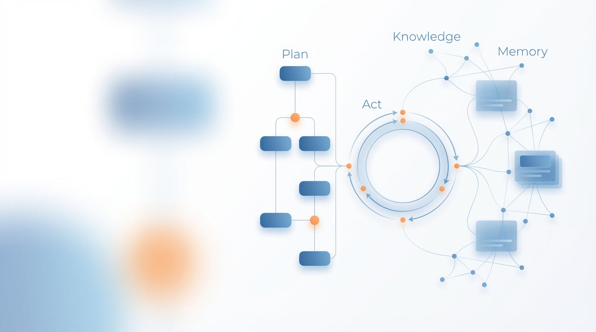

# Memfit AI

**Recursive Dual-Engine Hybrid Architecture for Intelligent Agent Systems**

[English](#english) | [中文](#中文)

---

## English

### What is Memfit AI?

Memfit AI breaks through the limitations of single paradigms by innovatively adopting a **Recursive Coupling of ReAct and Plan-Execute** hybrid architecture. This architecture organically fuses macroscopic **Strategic Planning** with microscopic **Tactical Execution** through a Coordinator, achieving a unity of determinism and flexibility in task processing.

### Core Architecture

#### Recursive Dual-Engine

| Engine | Layer | Responsibility |
|--------|-------|----------------|
| **Plan Engine** | Strategic | Macroscopic deconstruction of tasks into structured **Task Trees** with temporal dependencies and logical associations |
| **ReAct Engine** | Tactical | Dynamic execution of atomic tasks through "Observation - Thought - Action" closed loops |

**Recursive Coupling Mechanism:** When the ReAct engine encounters complex sub-problems, it dynamically triggers the Plan engine for **Sub-planning**. This recursive mechanism supports fractal expansion of tasks, adapting to business scenarios of arbitrary complexity.

#### Dual-Mode User Entry

1. **Coordinator Entry (Plan-Execute Mode)**
   - For vague or complex tasks
   - Flow: `User → Coordinator → Planning Loop → Review → Runtime → ReAct Loops`

2. **ReAct Entry (Instant Execution Mode)**
   - For clear, atomic instructions
   - Flow: `User → ReAct Loop → Thought → Action → Observation`

#### Key Components

- **Coordinator** - System bus and lifecycle manager
- **ReActLoop** - Minimal execution unit with "Reasoning-Acting" cycle
- **Tools & Forges** - Standardized atomic capabilities and scenario-based AI Blueprints
- **Memory Triage** - Intelligent long-term memory using C.O.R.E. P.A.C.T. Framework
- **RAG System** - Active, agentic knowledge service with hybrid indexing

#### Reliability Assurance

- **Self-Reflection** - Analyzes failures and generates correction plans
- **Spin Detection** - Prevents infinite loops in actions or logic
- **Memory-Augmented Recovery** - Retrieves historical error cases for decision support

### Quick Links

- [Full Documentation](https://memfit.ai/docs/architecture)
- [Yaklang](https://yaklang.com) - The underlying language powering Memfit AI
- [SSA Analysis](https://ssa.to) - Static Single Assignment analysis platform

---

## 中文

### 什么是 Memfit AI？

Memfit AI 突破了单一范式的局限，创新性地采用了 **ReAct 与 Plan-Execute 递归耦合** 的混合架构。该架构通过 Coordinator（协调器）将宏观的 **战略规划** 与微观的 **战术执行** 有机融合，实现了任务处理中确定性与灵活性的统一。

### 核心架构

#### 递归式双引擎

| 引擎 | 层级 | 职责 |
|------|------|------|
| **Plan 引擎** | 战略层 | 将顶层目标拆解为具备时序依赖与逻辑关联的结构化 **任务树** |
| **ReAct 引擎** | 战术层 | 通过 "观察 - 推理 - 行动" 的闭环机制动态执行原子任务 |

**递归耦合机制：** 当 ReAct 引擎遇到复杂子问题时，可动态触发 Plan 引擎进行 **次级规划**。这种递归调用机制支持任务的分形扩展，可适应任意复杂度的业务场景。

#### 双模态用户入口

1. **Coordinator 入口 (Plan-Execute 模式)**
   - 适用于模糊或复杂的任务
   - 流程：`用户 → Coordinator → 规划循环 → 审查 → 运行时 → ReAct Loops`

2. **ReAct 入口 (即时执行模式)**
   - 适用于明确的原子化指令
   - 流程：`用户 → ReAct Loop → 思考 → 行动 → 观察`

#### 关键组件

- **Coordinator** - 系统总线与生命周期管理器
- **ReActLoop** - 最小执行单元，驱动 "Reasoning-Acting" 循环
- **Tools & Forges** - 标准化原子能力与场景化 AI 蓝图
- **Memory Triage** - 基于 C.O.R.E. P.A.C.T. 框架的智能长期记忆
- **RAG System** - 主动式代理化知识服务，支持混合索引

#### 可靠性保障

- **自我反思** - 分析失败原因并生成修正计划
- **自旋检测** - 防止动作或逻辑死循环
- **记忆增强恢复** - 检索历史相似错误案例辅助决策

### 快速链接

- [完整文档](https://memfit.ai/zh/docs/architecture)
- [Yaklang](https://yaklang.com) - 驱动 Memfit AI 的底层语言
- [SSA 分析平台](https://ssa.to) - 静态单赋值分析平台

---

**Built with Yaklang**

Copyright © 2025 Memfit AI. All rights reserved.

